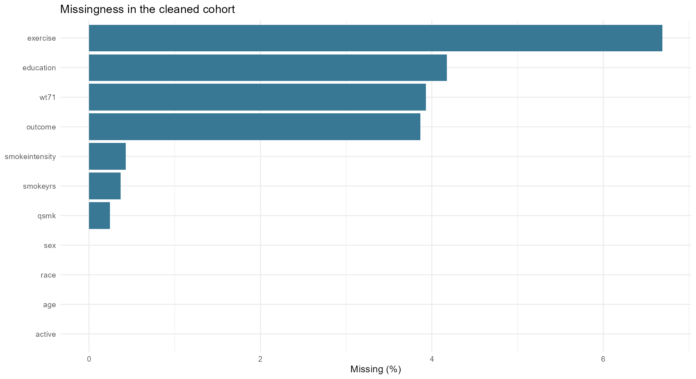
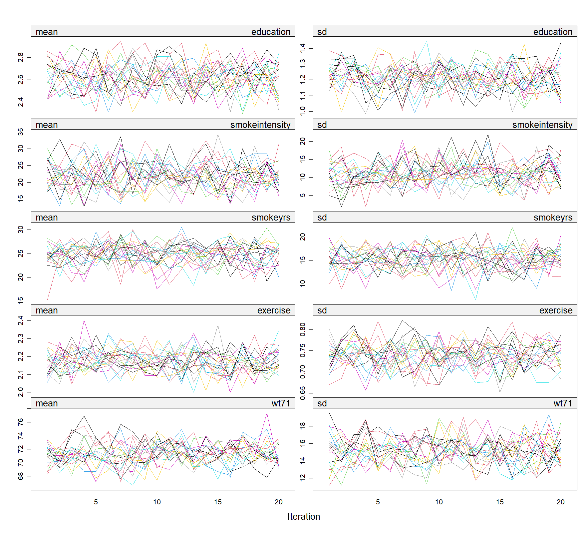
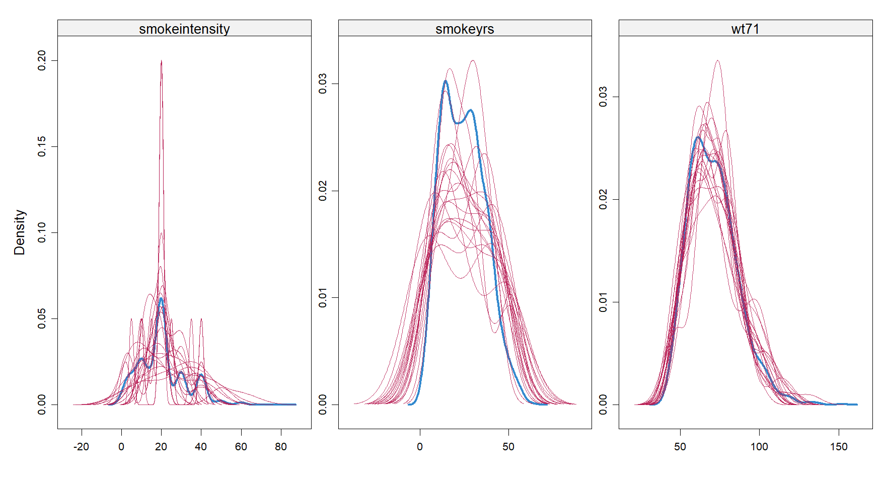
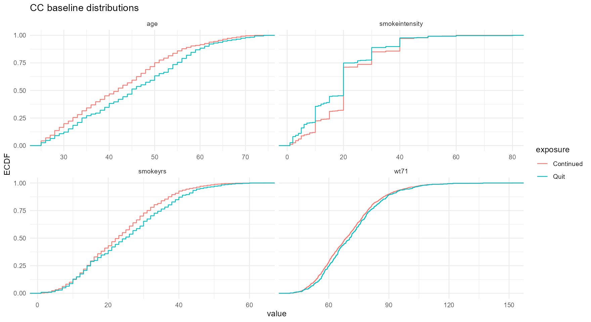
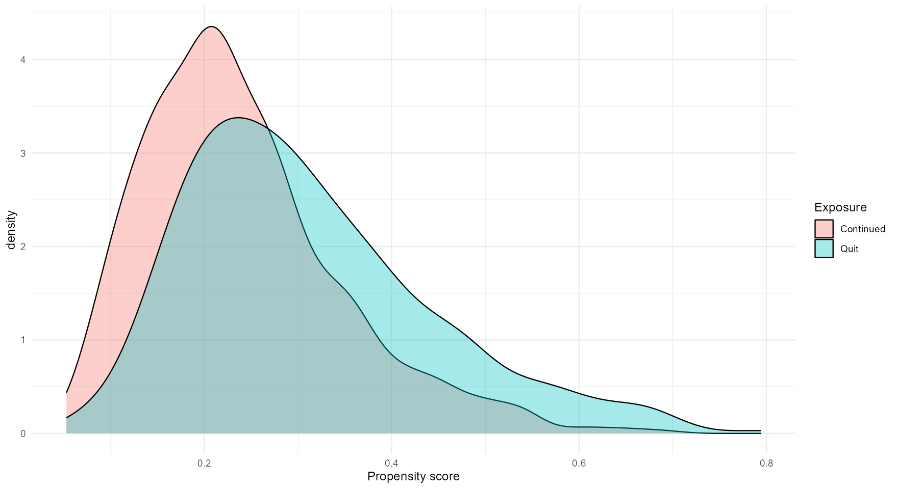
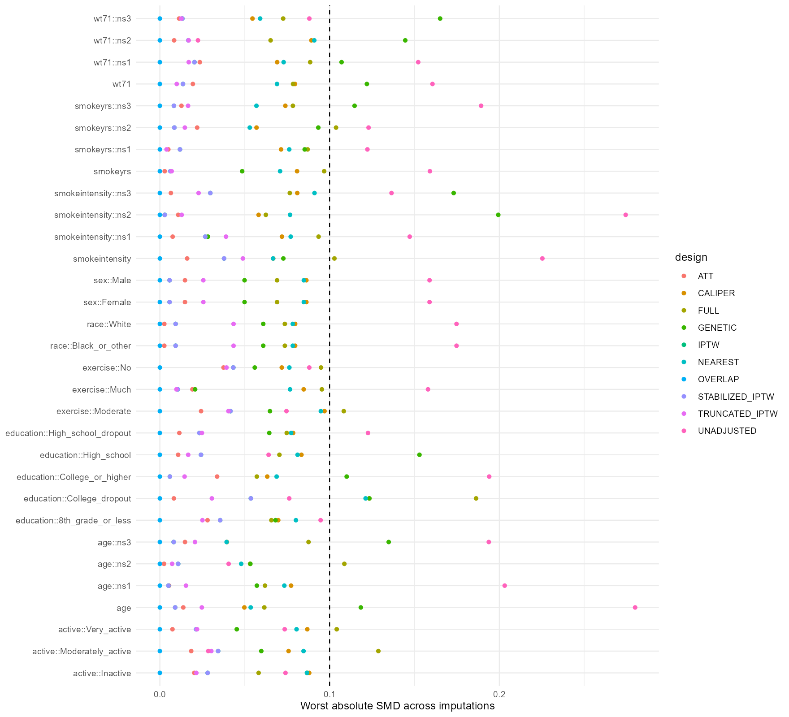
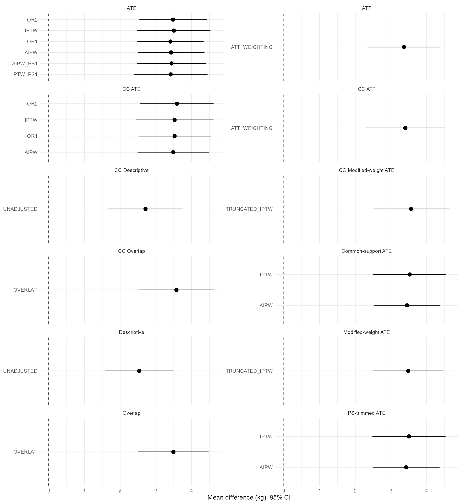

```{r}
#| label: setup
# readr 读取运行输出；knitr 排版表格。报告不执行 MICE、匹配或模型重拟合。
if (.Platform$OS.type == "windows" && !l10n_info()[["UTF-8"]]) {
  invisible(Sys.setlocale("LC_CTYPE", ".UTF-8"))
}
source("functions.R", encoding = "UTF-8")
read_result <- function(name) {
  path <- file.path("results", paste0(name, ".csv"))
  if (!file.exists(path)) stop("缺少输出，请先运行 00_main.R：", path)
  readr::read_csv(path, show_col_types = FALSE)
}
hash <- read_result("code_checksums")
if (!identical(unname(code_md5(hash$file)), hash$md5)) stop("分析代码已变更，请先重新运行 00_main.R")
input_hash <- read_result("input_checksums")
available <- file.exists(file.path("data", input_hash$file))
if (any(available) && !identical(unname(code_md5(file.path("data", input_hash$file[available]))), input_hash$md5[available])) {
  stop("本地输入已变更，请先重新分析，不使用旧结果渲染")
}
meta <- read_result("run_metadata"); settings <- setNames(meta$value, meta$setting)
flow <- read_result("sample_flow"); counts <- setNames(flow$n, flow$stage)
effects <- read_result("pooled_effects"); design <- read_result("design_summary")
boot <- read_result("bootstrap"); missing <- read_result("missingness")
mi <- read_result("mice_diagnostics"); mce <- read_result("mice_mce")
quality <- read_result("matching_quality"); positivity <- read_result("positivity")
formal <- settings[["m"]] == "20" && settings[["maxit"]] == "20" &&
  settings[["bootstrap"]] == "500" && settings[["run_matching"]] == "TRUE" && settings[["draw_plots"]] == "TRUE"
format_effect <- function(method, target = "ATE") {
  r <- effects[effects$method == method & effects$estimand == target, ]
  if (nrow(r) != 1L) return("本次运行未估计")
  sprintf("%.2f kg (95%% CI %.2f to %.2f)", r$estimate, r$conf_low, r$conf_high)
}
display_table <- function(x, digits = 3L) knitr::kable(x, format = "html", digits = digits, escape = TRUE)
matches <- design[design$design %in% c("FULL", "NEAREST", "CALIPER", "GENETIC"), ]
```

::: {.callout-note}
本报告对应 `r if (formal) "正式默认参数运行" else "探索性/小规模验证运行，不能作为正式交付"`；分析完成时间：`r settings[["completed_at_UTC"]]`。
所有样本量、数值结果和诊断表从本项目输出读取，不从旧版工程报告复制。报告渲染不会重新运行统计分析。
:::

# 摘要

本项目研究戒烟与1971—1982年体重变化的调整后差异，重点展示从数据质量问题到因果分析设计的完整方法链。源数据来自 `causaldata::nhefs` 的公开教学数据；在此基础上人为加入编码异构、MAR风格基线缺失、哨兵值、kg/lb混用、逻辑冲突和重复提取。**这里的“RWE风格”描述的是模拟的数据质量挑战，不意味着项目使用了新采集的真实电子病历。**

去重后的患者数为 `r counts[["Clean unique people"]]`；主分析候选人群为 `r counts[["Analysis candidates"]]`，完整案例为 `r counts[["CC"]]`。基线缺失采用 `r settings[["m"]]` 次多重插补；先在每个完成数据中建立设计并估计效应，再以Rubin规则合并。

稳定IPTW的体重变化差异为 `r format_effect("IPTW")`，AIPW为 `r format_effect("AIPW")`。正值性、协变量平衡和有效样本量是解释这些估计的前提；不同目标人群的方法分别报告。本次 `r nrow(matches)` 种匹配方案中，`r sum(matches$all_balance_pass)` 种在所有插补中达到预设平衡标准，未达标方案不报告正式匹配效应。

这些结果是给定数据、模型和识别假设下的方法演示，不能解释为对全体吸烟者无条件成立的临床效应。

# 研究问题、数据来源与目标人群

## 暴露、结局和基线变量

| 项目 | 定义 |
|---|---|
| 暴露 | `qsmk`：戒烟相对于继续吸烟 |
| 结局 | `wt82_71`：1982年与1971年的体重差，单位kg；正效应表示戒烟组相对体重增加更多 |
| 连续基线协变量 | 年龄、每日吸烟量、吸烟年限、1971年体重 |
| 分类基线协变量 | 性别、种族、教育、运动、活动水平 |
| 主分析目标 | 暴露可解析、结局已观测且通过预定质量规则的候选人群中的ATE |
| 辅助变量 | 人工来源标签和年龄中心化平方项用于插补，不机械加入所有因果模型 |

NHEFS是观察性随访数据的教学整理版本。数据和问题背景参考 [Hernán与Robins的教材及配套材料](https://miguelhernan.org/whatifbook)，程序化读取入口为 [causaldata](https://github.com/NickCH-K/causaldata)。本项目没有模拟出已知的真实因果效应，因此不能用方法间估计接近来证明估计无偏。

原数据已经存在结局缺失。主分析排除这些记录，所以这里的ATE不是整个原始NHEFS样本或全国总体的ATE。没有使用复杂调查抽样权重进行全国代表性推断。

## 样本形成

```{r}
#| label: tbl-flow
#| tbl-cap: "数据层与分析分支的样本规模"
labels <- c("公开源数据患者", "模拟提取行", "隔离的重复版本行", "清洗后唯一患者", "暴露已知患者",
            "暴露和结局均已知", "主分析候选患者", "完整案例分支", "MICE分支患者")
display_table(data.frame(阶段 = labels, 数量 = flow$n), digits = 0)
```

提取行与患者数不是同一个分母。CC与MICE是候选人群的两条分析分支，不是接续排除步骤；MICE保留候选人群中的基线缺失患者，但不恢复缺失结局患者。

# 人工质量降级与确定性清洗

## 生成规则

`00_prepare.R` 沿用种子 `r settings[["preparation_seed"]]`，在新建或显式重建提取层时生效；已有dirty文件默认保留，输入指纹另存于 `results/input_checksums.csv`。每第四位患者分配 `Registry_B`，其余分配 `EHR_A`；重复版本分配 `Late_feed`。这些标签与时间戳完全是人工生成，不能用于推断真实医疗机构的质量差异。

教育、运动和基线体重的额外缺失概率分别依赖年龄/来源、吸烟强度/来源、年龄/来源。这是MAR风格的训练设置；可观测变量与缺失相关不能证明整个真实数据过程满足MAR。

```{r}
#| label: tbl-simulation
#| tbl-cap: "原有缺失与人为新增缺失的区别：重复添加前的患者层"
s <- read_result("simulation_summary")
names(s) <- c("变量", "源数据原有缺失", "降级后缺失或Unknown", "人为新增缺失或Unknown")
display_table(s, digits = 0)
```

该表只统计NA/Unknown；999、单位异常、前导零、空格和跨字段冲突在下表另列。源数据真值仅用于区分缺失来源，不参与清洗或插补恢复。

## 清洗决策与结果

```{r}
#| label: tbl-cleaning
#| tbl-cap: "主要数据质量问题、计数口径和解决方法"
c <- read_result("cleaning_summary")
names(c) <- c("问题", "影响数量", "计数口径", "处理")
display_table(c, digits = 0)
```

清洗与统计插补分开：已知词典统一编码；999和不可能的吸烟年限置NA；不能解释的暴露不猜测。单位换算依赖生成时保留的 `wt71_lb_source` 谱系，而不是仅因体重偏大就认定为磅。这一参考字段是模拟条件下较理想的单位线索，不应声称代表真实EHR必然可得的独立校验。

重复记录按**基线完整性、预定义来源优先级、时间戳、行号**排序。未被选择的版本进入本地隔离表。版本选择不依据结局或效果显著性。年龄派生项、磅制体重派生项不与其原变量重复进入模型。

# 缺失处理与基线诊断

## 缺失规模、模式与选择模型

```{r}
#| label: tbl-missing
#| tbl-cap: "清洗后唯一患者中的缺失率；分母为清洗人群而非候选人群"
display_table(missing[missing$n_missing > 0, c("variable", "n_missing", "percent", "n_total")], digits = 2)
```

{#fig-missing}

```{r}
#| label: tbl-missing-patterns
#| tbl-cap: "最常见的缺失组合（前十种）"
display_table(head(read_result("missing_patterns"), 10), digits = 0)
```

缺失选择模型以“任一基线缺失”为因变量，考察年龄、性别、种族和人工来源；CC选择模型考察完整案例保留与暴露、来源、年龄、性别、种族的关系。它们用于展示选择机制，不作为额外的缺失结局权重。

```{r}
#| label: tbl-missing-selection
#| tbl-cap: "基线缺失选择Logistic模型：OR及Wald区间"
display_table(read_result("missing_selection"))
```

```{r}
#| label: tbl-cc-selection
#| tbl-cap: "完整案例被保留的选择Logistic模型"
display_table(read_result("cc_selection"))
```

来源与缺失相关主要反映人为生成机制，而不是外部临床发现。完整案例分析同时改变缺失处理与入选人群，不能只作为相同总体下的另一个估计器解释。

## MICE设置与质量检查

连续缺失采用PMM；二分类采用Logistic插补；多分类采用多项Logistic插补。当前实际启用的变量如下。每条链迭代 `r settings[["maxit"]]` 次；暴露、结局和ID不作插补，已观测结局可预测基线协变量。

```{r}
#| label: tbl-mice-methods
#| tbl-cap: "各变量的插补方法；空方法表示不插补"
display_table(read_result("mice_methods"), digits = 0)
```

本次 `r nrow(mi)` 个完成数据中，基线缺失检查均为 `r if (all(mi$missing_baseline == 0)) "零" else "非零：需复核"`，观测暴露及结局保持不变的检查 `r if (all(mi$unchanged_exposure & mi$unchanged_outcome)) "全部通过" else "未全部通过"`。范围和跨字段逻辑异常不会被静默截成合法数值。

MICE记录的事件数为 `r settings[["mice_logged_events"]]`；即使没有事件，也仍需检查轨迹、完成数据逻辑和有限插补次数的模拟误差。

{#fig-trace}

{#fig-mice-density}

蓝线为观测分布，红线为各次插补分布。当前吸烟强度需插补的记录只有 `r read_result("mice_methods")$n_missing[read_result("mice_methods")$variable == "smokeintensity"]` 条，因此其核密度曲线可能尖锐且不稳定。平滑曲线延伸到合法范围之外不等于插补值越界；实际范围已逐值检查。MAR条件下观测与缺失人群的边际分布也不必完全相同，不能仅凭曲线是否重合决定插补模型好坏。

```{r}
#| label: tbl-mice-convergence
#| tbl-cap: "末次迭代的MICE收敛指标；需结合轨迹而非单独作为保证"
conv <- read_result("mice_convergence")
imputed_variables <- read_result("mice_methods")$variable[read_result("mice_methods")$n_missing > 0]
display_table(conv[conv$.it == max(conv$.it) & conv$vrb %in% imputed_variables, ], digits = 3)
```

预指定诊断回归中最大的MCE/SE为 `r sprintf("%.3f", max(mce$mce_over_se))`；超过0.10提示需增加插补次数。本回归系数不作为正式因果效应。Rubin合并发生在效应与方差层，不堆叠所有完成数据，也不平均PS后分析。

## Table 1、ECDF和共线性

```{r}
#| label: tbl-baseline
#| tbl-cap: "完整案例人群Table 1与SMD：描述性而非MI合并表"
display_table(read_result("table1"))
```

{#fig-ecdf}

```{r}
#| label: tbl-vif
#| tbl-cap: "基线设计矩阵的VIF/GVIF"
display_table(read_result("collinearity"))
```

线性基线设计矩阵秩/列数为 `r settings[["design_rank"]]` / `r settings[["design_columns"]]`，标准化条件数为 `r sprintf("%.2f", as.numeric(settings[["scaled_condition_number"]]))`。年龄和吸烟年限具有相关性，但不会因为单个VIF较高就机械删除预先指定的混杂因素。不同自由度的分类变量应查看调整后的GVIF，而不是直接比较原始GVIF。

# 倾向评分、正值性与设计诊断

## 模型与预设规则

主PS采用Logistic回归。年龄、每日吸烟量、吸烟年限和基线体重使用自然样条：内部结点为候选数据观测值的1/3、2/3分位数，边界为观测范围；结点在MI、CC、修剪和bootstrap中保持固定。线性PS作为规格敏感性，不用结局显著性来选择设计。

权重包括ATE的普通IPTW和稳定IPTW、ATT权重、overlap权重；主效应使用稳定IPTW。稳定权重的1%/99%截尾与PS的0.05/0.95修剪分开处理：前者不删除患者，后者改变人群并重新拟合PS/OR。

SMD固定使用调整前的标准差，ATT使用戒烟者标准差；其余设计使用两组调整前的合并标准差。检查连续变量、所有分类水平（包括参考水平）、样条基函数及PS/logit PS。门槛为各插补中最大绝对SMD均小于 `r settings[["smd_limit"]]`。

## 共同支持与权重质量

{#fig-ps}

所有插补的未经数值保护截断的PS范围为 `r sprintf("%.3f", min(positivity$ps_min))` 至 `r sprintf("%.3f", max(positivity$ps_max))`；每次插补落在经验共同支持域之外的人数范围为 `r min(positivity$outside_support)` 至 `r max(positivity$outside_support)`。这不是对所有协变量组合满足理论正值性的证明。

```{r}
#| label: tbl-positivity
#| tbl-cap: "正值性与支持域诊断：跨插补范围"
metrics <- c("outside_support", "ps_below_05", "ps_above_95", "empty_decile_cells", "sparse_clinical_cells")
display_table(data.frame(指标 = metrics, 最小 = vapply(positivity[metrics], min, numeric(1)),
                        最大 = vapply(positivity[metrics], max, numeric(1))), digits = 0)
```

```{r}
#| label: tbl-design
#| tbl-cap: "平衡、ECDF、有效样本量及最大权重：跨插补汇总"
display_table(design[, c("design", "estimand", "worst_smd", "worst_ecdf", "all_balance_pass", "median_ess", "min_ess", "max_weight")])
```

{#fig-balance}

有效样本量ESS描述权重集中程度，不替代原始样本量，也不能单独证明偏倚小。主IPTW通过平衡门槛是解释效果的必要设计依据，但不是充分的因果识别保证。

## 四种匹配：保留失败诊断

完全匹配目标为ATE；最近邻、卡尺和遗传匹配目标为ATT。最近邻为1:1、不放回；卡尺为每次插补logit PS标准差的0.2倍。遗传匹配优化协变量距离权重，种子固定，并在每次插补独立运行。

```{r}
#| label: tbl-matching
#| tbl-cap: "匹配方案是否在所有插补中通过预设平衡标准"
features <- read_result("balance_summary")
worst_features <- do.call(rbind, lapply(split(features, features$design), function(d) {
  k <- which.max(d$worst_abs_smd)
  data.frame(design = d$design[k], worst_feature = d$feature[k])
}))
matching_display <- merge(matches, worst_features, by = "design", sort = FALSE)
display_table(matching_display[, c("design", "estimand", "imputations", "worst_smd", "worst_feature", "all_balance_pass", "min_ess")])
```

卡尺违例合计为 `r sum(quality$caliper_violations, na.rm = TRUE)`。算法执行成功与患者配对合法，并不代表残余失衡已经可接受。本次 `r sum(!matches$all_balance_pass)` 个方案至少有一次插补不达标；它们只保留诊断，不通过放宽门槛、选择最好的一次插补或观察结局来获得可报告效应。通过门槛的匹配估计使用子类聚类稳健方差。

# 主效应、标准化与不确定性

## 候选人群中的主要ATE

```{r}
#| label: tbl-primary
#| tbl-cap: "主分析与相同候选人群下的方法比较；单位kg"
main <- effects[effects$method %in% c("IPTW", "AIPW", "OR1", "OR2", "UNADJUSTED") &
                  effects$estimand %in% c("ATE", "Descriptive"), ]
display_table(main[, c("method", "estimand", "m", "estimate", "se", "conf_low", "conf_high", "fmi")])
```

稳定IPTW为 `r format_effect("IPTW")`；AIPW为 `r format_effect("AIPW")`。未调整差异为 `r format_effect("UNADJUSTED", "Descriptive")`，它是描述性比较，不是因果结论。OR1为线性结局模型，OR2在两暴露组分别拟合灵活模型并在候选经验协变量分布上标准化。

AIPW将OR的潜在结局预测与PS加权残差校正结合。在交换性、正值性等前提下，它具有PS或OR至少一个正确设定时的双重稳健性质；并不意味着未测量混杂、选择偏倚和两模型同时错误会被自动消除。

令 `A` 表示戒烟，`e(X)` 为PS，`m1(X)`/`m0(X)`为两组OR预测，则每次完成数据的AIPW计算为：

```text
mean[ m1(X) - m0(X) + A*(Y-m1(X))/e(X)
                       - (1-A)*(Y-m0(X))/(1-e(X)) ]
```

每次插补先产生点估计与组内方差，随后采用Rubin规则和有限样本自由度合并。FMI包含有限样本调整，不只用简单的插补间方差占比代替。

合并的核心是 `Q_bar = mean(Q_j)` 与 `T = mean(U_j) + (1 + 1/m)*var(Q_j)`。这里 `U_j` 是第j次完成数据的效应方差，而不是该数据内结局的样本方差；区间自由度按Barnard–Rubin方法处理。

## 方差处理与bootstrap边界

非匹配加权回归采用HC0 sandwich方差，条件于当前拟合权重；OR采用条件于经验协变量分布的delta/HC0方差；AIPW采用经验影响函数方差。这些解析方差对模型估计和有限样本存在不同近似，因此以重新拟合模型的bootstrap作方差敏感性参照。

```{r}
#| label: tbl-bootstrap
#| tbl-cap: "代表插补中的bootstrap：重抽参与者并重新拟合PS/OR"
display_table(boot[, c("method", "representative_imputation", "success", "requested", "analytic_se", "bootstrap_se", "se_ratio", "percentile_low", "percentile_high")])
```

`se_ratio` 为bootstrap SE除以该代表插补的解析SE，不是除以Rubin合并SE。百分位区间针对固定代表插补，**没有重新执行MICE全流程，也没有合并插补间变异**，不能替代主分析的MI区间。成功率和重拟合失败应同时检查，而不只看区间宽度。

# 敏感性分析：区分模型与目标人群变化

{#fig-effects}

```{r}
#| label: tbl-sensitivity
#| tbl-cap: "规格、缺失处理、截尾与不同目标人群的敏感性结果"
sensitivity <- effects[!effects$method %in% c("IPTW", "AIPW", "OR1", "OR2", "UNADJUSTED"), ]
display_table(sensitivity[, c("method", "estimand", "estimate", "se", "conf_low", "conf_high")])
```

线性PS-1下IPTW为 `r format_effect("IPTW_PS1")`，与主PS-2相比用于考察函数形式敏感性。完整案例IPTW为 `r format_effect("CC_IPTW", "CC ATE")`，但其目标已变成CC选入人群；数值接近不能排除完整案例选择偏倚。

PS修剪和共同支持域限制会删除患者。各插补中的纳入成员可能不同，因此即使模型固定，修剪后的经验目标人群也可能略有变化。权重截尾是偏倚—方差折中后的修改权重估计，不应无说明地仍称为原ATE。

ATT对应戒烟者目标，overlap对应两组治疗选择都有较大可能的重叠目标；与ATE不同不是方法失败，与ATE接近也不是识别验证。

```{r}
#| label: tbl-target-populations
#| tbl-cap: "敏感性分支中样本数及协变量描述的跨插补范围"
pop <- read_result("sensitivity_populations")
pop_summary <- do.call(rbind, lapply(split(pop, pop$scenario), function(d) data.frame(
  scenario = d$scenario[1], n_min = min(d$n), n_max = max(d$n),
  age_min = min(d$age_mean), age_max = max(d$age_mean),
  smoke_min = min(d$smoke_mean), smoke_max = max(d$smoke_mean))))
display_table(pop_summary)
```

ATT/overlap行展示权重后协变量描述；其原始行数不代表有效样本量或全国目标人口规模。

# 结论、局限与项目交付

本项目完成了可复现的“公开数据—人工质量降级—确定性清洗—缺失处理—设计诊断—效应估计”链条。主IPTW与AIPW的正向差异在本次候选人群和给定模型下较接近；应把这理解为方法比较结果，而不是仅凭一致性认定因果关系已证明。匹配的失败诊断和目标人群的明确标签也是主体分析结果的一部分。

主要局限如下：

- 模拟质量问题由作者指定，缺失机制与单位谱系比真实临床数据更清楚；本项目不是对真实EHR质量的经验评估。
- 基线MICE依赖MAR等工作假设，诊断不能证明MAR；结局缺失患者被排除，未开展其完整MAR/MNAR敏感性分析。
- 戒烟时点、基线与随访区间不完全等同于可精确对齐的目标试验；暴露版本和可能的时间相关偏倚需谨慎。
- 未测量混杂、模型错设与positivity不足不能靠平衡图自动解决；正值性是数据支持与实质知识共同约束。
- 同样本拟合的AIPW未交叉拟合；解析方差和单代表插补bootstrap均有已说明的近似边界。
- 未做复杂调查抽样推断或全国推广。95%区间只覆盖所用统计程序的模型内不确定性，不包含所有设计与识别不确定性。

项目保留简单脚本而不建立额外审计框架。`results/` 的汇总CSV和PNG可供仓库阅读；逐人数据和本地RDS不默认上传。报告源码随输出保留，运行前的参数和包用途在 `00_main.R` 中集中说明，已验证版本记录于 `renv.lock`。

## 复现环境

```{r}
#| label: tbl-environment
#| tbl-cap: "分析程序包版本及作用"
display_table(read_result("package_versions"))
```

R版本：`r settings[["R_version"]]`。MICE种子：`r settings[["seed"]]`；bootstrap种子：`r settings[["bootstrap_seed"]]`。四种匹配在各插补中采用预先指定种子。严格数值复现需同时固定软件版本，而不仅仅固定随机种子。

## 参考资料

1. Hernán MA, Robins JM. *Causal Inference: What If*. [教材及配套数据](https://miguelhernan.org/whatifbook)。
2. [causaldata](https://github.com/NickCH-K/causaldata)：教学数据来源；原数据与软件许可须分别核对。
3. [mice：多重插补与合并](https://amices.org/mice/)；[MatchIt：倾向评分匹配设计](https://kosukeimai.github.io/MatchIt/)；[sandwich：稳健方差](https://sandwich.r-forge.r-project.org/)。
4. [Quarto：项目执行目录与计算管理](https://quarto.org/docs/projects/code-execution.html)；[renv：记录已安装版本](https://rstudio.github.io/renv/reference/snapshot.html)。
